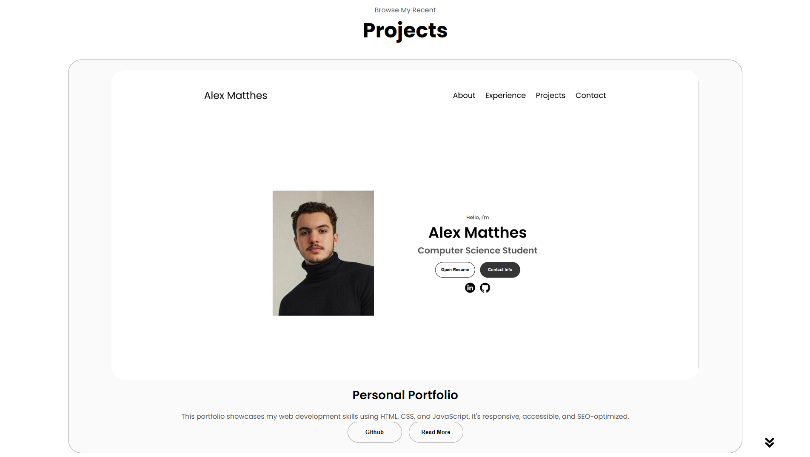
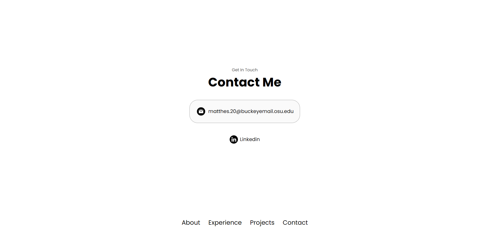

# Alex Matthes | Personal Portfolio

Welcome to my personal portfolio repository! This site was created to showcase my skills, experience, and projects as a Computer Science and Engineering student at The Ohio State University. I am actively seeking internship opportunities and open to collaboration.

---

## 🌟 About Me

I am a Computer Science and Engineering major (B.S.) with a minor in Theatre at OSU. I am passionate about software development, problem-solving, and building accessible web experiences. My portfolio highlights my journey and the skills I've gained through coursework, personal projects, and professional experiences.

- **Location:** Columbus, Ohio
- **Status:** Open to Software Developer Internship opportunities
- **Contact:** [matthes.20@buckeyemail.osu.edu](mailto:matthes.20@buckeyemail.osu.edu)
- **LinkedIn:** [linkedin.com/in/matthesdev](https://linkedin.com/in/matthesdev)
- **GitHub:** [github.com/alexmatthes](https://github.com/alexmatthes)

---

## 🗂️ Project Overview

This portfolio is a responsive, accessible, and SEO-optimized website built with:
- **HTML5**
- **CSS3** (including responsive design via `mediaqueries.css`)
- **JavaScript**

### 🔑 Key Features
- Clear, single-page navigation with anchor links for easy browsing
- Professional UI/UX with a focus on readability and accessibility
- Downloadable resume and direct email contact options
- Project gallery with screenshots and "Read More" details
- Social links to LinkedIn and GitHub

---

## 🛠️ Skills & Tools

**Languages:**
- Java (Experienced)
- C++ (Experienced)
- HTML/CSS (Experienced)
- JavaScript (Familiar)

**Developer Tools & Platforms:**
- Git & GitHub
- VS Code
- Figma
- Linux/Unix Environments

---

## 📸 Screenshots

| Main Profile Section | Projects Display | Contact Section |
|---------------------|------------------|----------------|
|  |  |  |

---

## 📬 Contact

Feel free to reach out for opportunities, collaboration, or questions!

- **Email:** [matthes.20@buckeyemail.osu.edu](mailto:matthes.20@buckeyemail.osu.edu)
- **LinkedIn:** [linkedin.com/in/matthesdev](https://linkedin.com/in/matthesdev)

---

## 📝 License

This project is licensed under the MIT License. See the `LICENSE` file for details.

&copy; 2025 Alex Matthes
